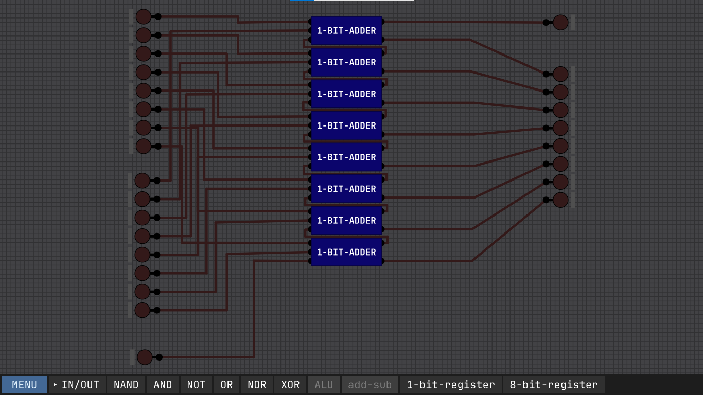
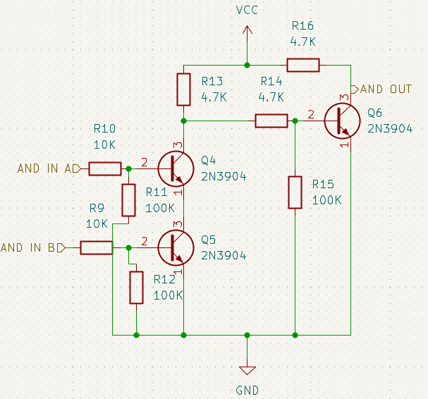
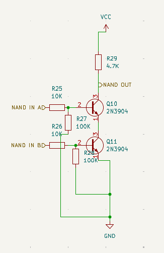
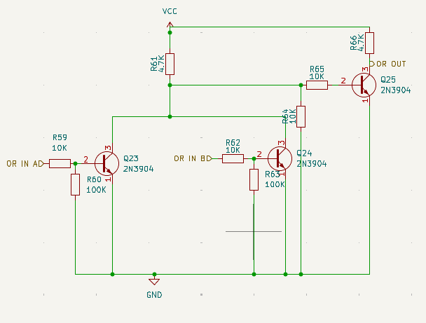

# 8-bit-Adder-Subtract

8 bit Adder and Subtractor is 8 bit calculator which can add upto 
256 and subtract upto -256 .
This is a made using 2N3904 transistor .

The above image shows the basic logic of the 1 bit adder using logic gates.

The above image shows the how we can use the simple 1 bit adder to make 8 bit adder.

# Logic gate making
## logic gate in real life uses transistor to work it is not simulation which is running on Billions of the Transistors . which are ready made with two input pin and one output pins.

The above image shows the circuit diagram of the AND gate.

The above image shows the circuit diagram of the NAND gate.

The above image shows the circuit diagram of the OR gate.