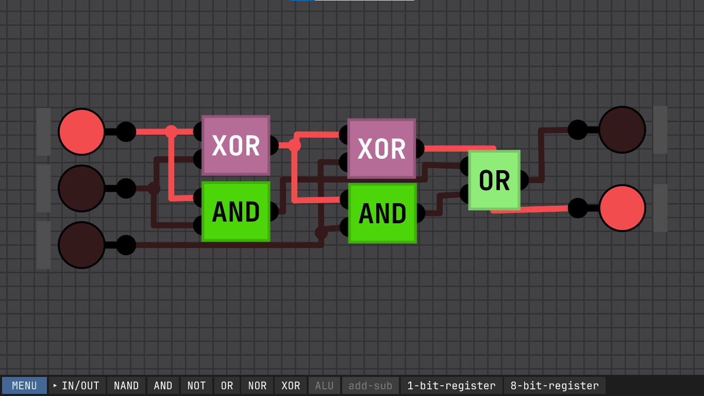
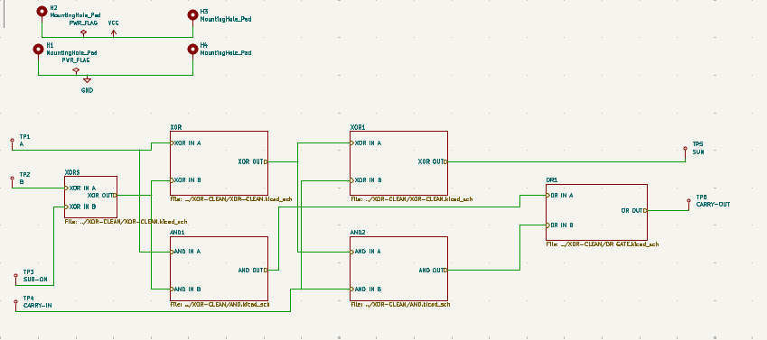
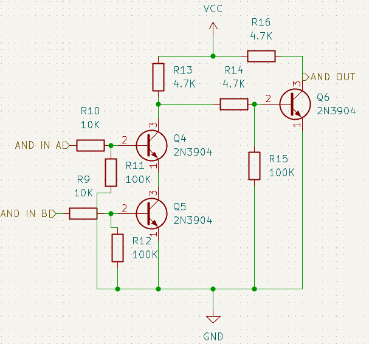
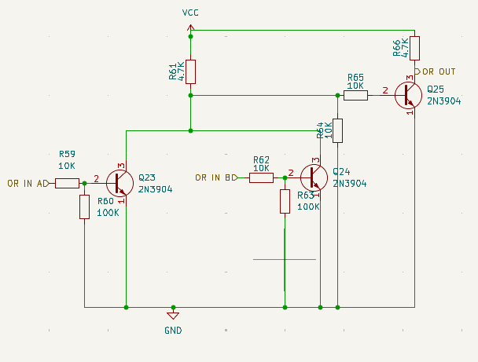

# 8-bit-Adder-Subtract

8 bit Adder and Subtractor is 8 bit calculator which can add upto 
256 and subtract upto -256 .
This is a made using 2N3904 transistor .

The above image shows the basic logic of the 1 bit adder using logic gates.

The above image is the circuit diagram of the 1 bit adder

# Logic Gate Making

## Logic gates in real life use transistors to work. It is not simulation running inside software, but physical circuits built using billions of transistors in ICs, each acting like ready-made logic blocks with inputs and outputs.

The above image shows the circuit diagram of the AND gate.

The above image shows the circuit diagram of the NAND gate.

The above image shows the circuit diagram of the OR gate.

# BOM 
# Bill of Materials (BOM)

| Name | Purpose | Quantity | Total Cost (USD) | Link | Distributor |
|------|--------|----------|------------------|------|-------------|
| PCB | This is the main component PCB | 10 | 30.58 | [Order PCB](https://robu.in/product/online-pcb-manufacturing-service/?gad_campaignid=21658520538&gad_source=1&gbraid=0AAAAADvLFWdNWmKenmdP5qNoEcapom7lV&gclid=CjwKCAjwwpDQBhAuEiwAa-4WozzkdGqJq98CDUbjn3c8oOIlN2qji0ctpNQ6oVCd5u_S7Tb7ccVTEhoCQEgQAvD_BwE) | Robu.in |
| Breadboard and Power Supply | For power and component assembly | 1 | 2.68 | [Buy Kit](https://www.amazon.in/gp/product/B01KW558NG/ref=ox_sc_act_title_4?smid=A3OFE3UKIO43OW&psc=1) | Amazon |
| 2N3904 Transistor (JCET) | Logic gate implementation | 270 | 14.11 | [View Transistor](https://robu.in/product/2n3904-tarange200-300-jcet-40v-625mw-10010ma1v-200ma-npn-to-92-2-54mm-bipolar-bjt-rohs/) | Robu.in |
| 4.7k Ohm Resistor | Collector / bias resistors | 210 | 0.39 | [View Resistor](https://robu.in/product/4-7k-ohm-1-8w-through-hole-resistor-pack-of-5000/) | Robu.in |
| 10k Ohm Resistor | Base resistors for transistor switching | 260 | 2.77 | [View Resistor](https://robu.in/product/10k-ohm-0-5w-metal-film-resistor-pack-of-50/) | Robu.in |
| 100k Ohm Resistor | Pull-down resistors | 240 | 2.46 | [View Resistor](https://robu.in/product/100k-ohm-0-5w-metal-film-resistor-pack-of-50/) | Robu.in |
| 470 Ohm Resistor | LED current limiting resistors | 60 | 0.11 | [View Resistor](https://robu.in/product/470-ohm-1-8w-through-hole-resistor-pack-of-5000/) | Robu.in |
| Red LED (10mm) | Input and output indicators | 30 | 1.18 | [View LED](https://robu.in/product/10mm-dip-led-red-10-pcs/) | Robu.in |
| 8-Way Slide Switch | Input selection switches (A & B buses) | 2 | 0.42 | [View Switch](https://robu.in/product/8-way-slide-switch-2-54mm-pitch-pack-of-3/) | Robu.in |
| 100µF Capacitor | Power supply smoothing and stability | 10 | 0.63 | [View Capacitor](https://robu.in/product/100uf-16v-electrolytic-capacitor-pack-of-20/) | Robu.in |
| M3 x 20mm Standoffs | PCB stacking and mechanical support | 32 | 3.24 | [View Standoffs](https://onlyscrews.in/products/m3-x-20mm-male-to-female-brass-with-nickel-plating) | Only Screws |
| Soldering Kit | Used for assembling and soldering components | 1 | 16.59 | [Buy Soldering Kit](https://www.amazon.in/Adjustable-Temperature-Electronics-Desoldering-Tweezers-Black/dp/B0FQ5QHNGY/) | Amazon |

This is the updated BOM 

# UPDATE 
Well there are two PCB both work , one is compact and another ne is labelled okay like showing each 'Nand' and 'And' and gates like that , both works .
